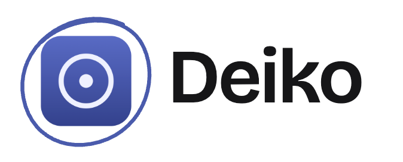
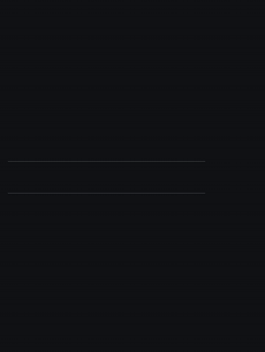
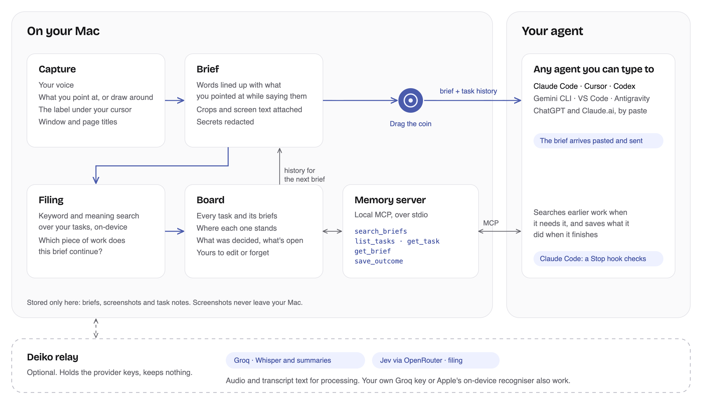
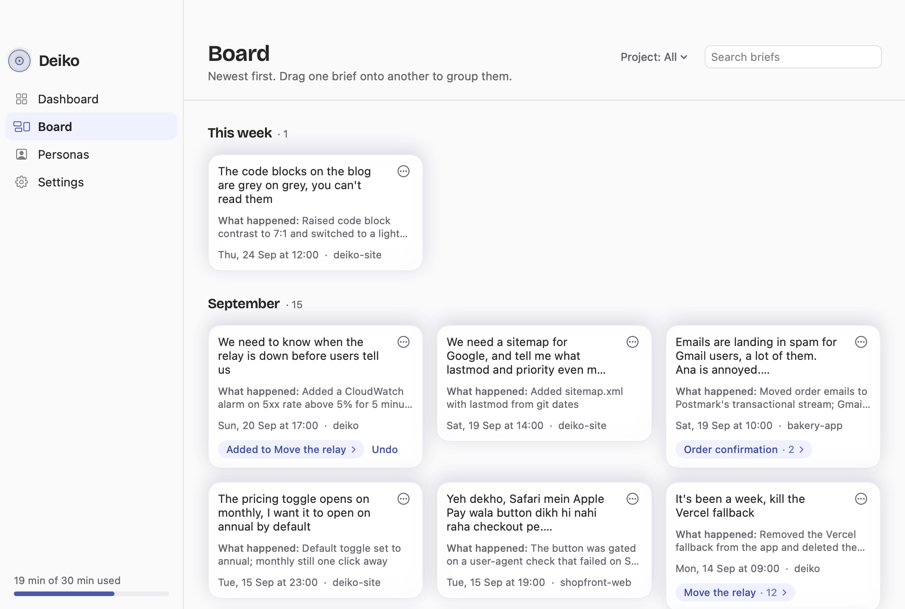

<h1 align="center">
  <a href="https://deiko.app">
    <picture>
      <source media="(prefers-color-scheme: dark)" srcset="docs/assets/logo-dark.png">
      
    </picture>
  </a>
</h1>

<h3 align="center">Point at it. Say it. Your agent remembers it.</h3>

<p align="center">
  Point, talk and annotate. Deiko turns it into a brief for Claude Code, Cursor, Codex or any MCP agent,<br>
  and keeps every task's context stored on your Mac. Free and open source.
</p>

<p align="center">
  <a href="LICENSE"></a>
  <a href="https://github.com/maddy30445r/deiko/releases"></a>
  
  <a href="https://github.com/maddy30445r/deiko/actions/workflows/ci.yml"></a>
  
</p>

<p align="center">
  
</p>

<p align="center">
  <a href="#install">Install</a> •
  <a href="#how-it-works">How it works</a> •
  <a href="#task-memory">Task memory</a> •
  <a href="#privacy">Privacy</a> •
  <a href="docs/architecture.md">Architecture</a> •
  <a href="docs/self-hosting.md">Self-hosting</a> •
  <a href="CONTRIBUTING.md">Contributing</a>
</p>

---

Describing a bug in prose is slow and lossy: you type a paragraph, take a
screenshot, attach it, then explain which part of the screenshot you meant.
With Deiko you point at the thing and say what's wrong. Your agent gets a brief
with the crop, the exact text under your cursor and your words, lined up so it
knows which "this" you meant. And because Deiko files every brief into the
piece of work it continues, Friday's agent already knows what Tuesday's agent
tried.

## Install

```sh
curl -fsSL https://deiko.app/install.sh | sh
```

Needs macOS 14 or later on Apple silicon. The script installs the latest
release to `/Applications` and launches it ([read it first](scripts/install.sh)).
A first-run window asks for four permissions and explains each one. For the
disk image, updating and uninstalling, see [docs/install.md](docs/install.md).

## How it works

1. **Double-tap Right Option** to start. A red bar shows while Deiko listens.
2. **Point and talk.** Rest the cursor on what you mean, or hold Left Option and
   draw around it. Say what should change.
3. **Tap Right Option** to stop. A coin appears with Deiko's reading of what you said.
4. **Drag the coin onto your agent.** The brief is pasted into that chat and sent.

<picture>
  <source media="(prefers-color-scheme: dark)" srcset="docs/assets/architecture-dark.png">
  
</picture>

Speech is transcribed by Whisper (through Deiko's relay, or your own Groq key)
or by Apple's on-device recogniser, and mixed-language speech such as
Hinglish works. Secrets on screen are redacted before anything is written; a
screenshot that shows a credential is withheld. More in
[docs/architecture.md](docs/architecture.md).

## Task memory

Every brief is filed into the piece of work it continues, or starts a new one.
Each task keeps a note of where it stands, what was decided and what each agent
reported back, and the next brief on that work carries it.

<picture>
  <source media="(prefers-color-scheme: dark)" srcset="docs/assets/board-dark.png">
  
</picture>

- **The board** shows every task. Move briefs, answer "Same work?", edit or
  forget any note, and pin project rules every brief should carry.
- **The memory server** gives MCP agents five tools: `search_briefs`,
  `list_tasks`, `get_task`, `get_brief` and `save_outcome`. One click in
  Settings connects it to Claude Code, Codex, Cursor, Gemini CLI, VS Code and
  Antigravity.
- **Agents report back.** When an agent finishes a brief it saves what it did,
  decided and left open, so the next chat starts there, in any agent. In
  Claude Code a Stop hook makes sure it does.

See [docs/memory.md](docs/memory.md).

## Works with

**Any agent you can type to.** Drop the coin on its window and the brief is
pasted and sent: Claude Code in a terminal or an IDE, Cursor, Codex, or ChatGPT
and Claude.ai in the browser. Browser chats can't call tools, so their briefs
carry the task's history inline.

**Task memory over MCP** connects in one click to Claude Code, Codex, Cursor,
Gemini CLI, VS Code and Antigravity, and any other MCP client can run the
server directly.

## Privacy

| | |
|---|---|
| **Stored** | Only on your Mac, in `~/Library/Application Support/Deiko`. Recordings are deleted once the brief is made. |
| **Sent for processing** | Your voice to Whisper (Groq), the transcript for a summary, and titles and summaries for filing (Jev via OpenRouter). Nothing is kept. |
| **Never sent** | Screenshots, OCR and accessibility text, except inside the brief you hand to your own agent. |

The relay's code is in this repository, so you can check it, or
[run your own](docs/self-hosting.md). Full details: [docs/privacy.md](docs/privacy.md).

## Pricing

Deiko is free and open source. Everything, Pro included, is free until
**24 October 2026**. After that, Pro is **$7.99 a month, $79 a year or $159
once**, and adds ten hours a month of Deiko's hosted transcription. Without Pro,
Deiko stays free to use: 30 minutes of hosted transcription, then Apple's
on-device recogniser, or your own Groq key with no limit.

## Build from source

```sh
make setup           # Node dependencies
make signing-setup   # once, so macOS permissions survive rebuilds
make install         # build, sign, install and launch
make test            # Swift and Node test suites
```

Requires Xcode 26 and Node 22. See [CONTRIBUTING.md](CONTRIBUTING.md) for the
repository layout and conventions.

## Contributing

Issues and pull requests are welcome. Start with [CONTRIBUTING.md](CONTRIBUTING.md);
report security issues privately as described in [SECURITY.md](SECURITY.md).

## License

[MIT](LICENSE). Bundled third-party components keep their own licences; see
[apps/macos/licenses](apps/macos/licenses).

<p align="center">
  <a href="https://deiko.app">deiko.app</a> •
  <a href="CHANGELOG.md">Changelog</a> •
  <a href="https://github.com/maddy30445r/deiko/issues">Issues</a>
</p>
