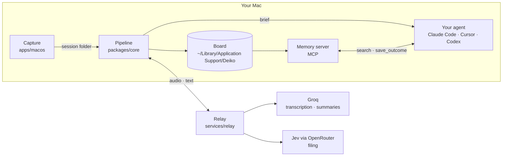

# Architecture

Deiko has three parts: a macOS app that captures what you point at and say, a
Node pipeline that turns a capture into a brief and files it, and an optional
relay that runs the cloud models so nobody needs their own API keys.

## Capture (`apps/macos`)

A menu-bar app. Double-tap Right Option to start a session, talk, and point:
the cursor, a lasso (hold Left Option) or a click marks what you mean. While
you speak, Deiko records:

- the microphone, for your narration;
- a crop of the screen around each point, and its OCR text;
- the accessibility label under the cursor (a button's title, a cell's value);
- window and page titles, which give the file, repo, site or ticket.

A session is a folder of events, crops and audio. The app is split into
libraries that hold the testable logic (`DeikoGesture`, `DeikoVoice`,
`DeikoGrounding`, `DeikoHandoff`) and the app target, `DeikoCapture`, which
owns the UI and system integration.

## Pipeline (`packages/core`)

Node scripts the app runs on each session, in order:

| Stage | Script | What it does |
|---|---|---|
| Transcribe | `transcribe.mjs` | Speech to words with timings: your Groq key, the relay, or Apple's on-device recogniser |
| Brief | `render-brief.mjs` | Aligns each word with what you pointed at while saying it ([`packages/alignment`](../packages/alignment)), redacts secrets and writes the prompt |
| Summary | `summarize.mjs` | A short summary for the board and for matching |
| Filing | `classify.mjs` | Places the brief in a project and a task (below) |
| Memory | `task-notes.mjs` | Rebuilds each task's note: where it stands, what was decided, every brief |

Redaction is fail-closed: if a credential survives into the prompt, the
renderer refuses to write it, and a screenshot showing one is withheld.

## Filing

Each brief is filed into the piece of work it continues, or starts a new one.

1. **Local shortlist.** The Mac ranks existing tasks by keyword overlap (BM25)
   blended with meaning (EmbeddingGemma, running on-device through ONNX).
2. **Judgement.** The shortlist, with each task's title and recent summaries,
   goes to Jev through the relay, which answers whether the brief is the same
   work, refers back to one, or is new.
3. **Decision.** Clear matches join; close calls ask "Same work?" on the card;
   everything else starts a new task. Nothing you placed by hand is moved.

Without a relay, filing falls back to the local shortlist alone.

## Hand-off and memory

When the brief is ready, a coin appears. Drag it onto your agent's window and
the prompt is pasted and sent; the prompt already carries the task's history.
Agents with MCP support also get the [memory server](memory.md), which lets
them search earlier briefs and save what they did when they finish.

## Relay (`services/relay`)

A small HTTP service (AWS Lambda in production) with three routes the app
uses: `/v1/transcribe`, `/v1/summarize` and `/v1/classify`. It holds the
provider keys, meters free usage per install, and stores no audio, text or
screenshots. See [self-hosting](self-hosting.md) to run your own.
